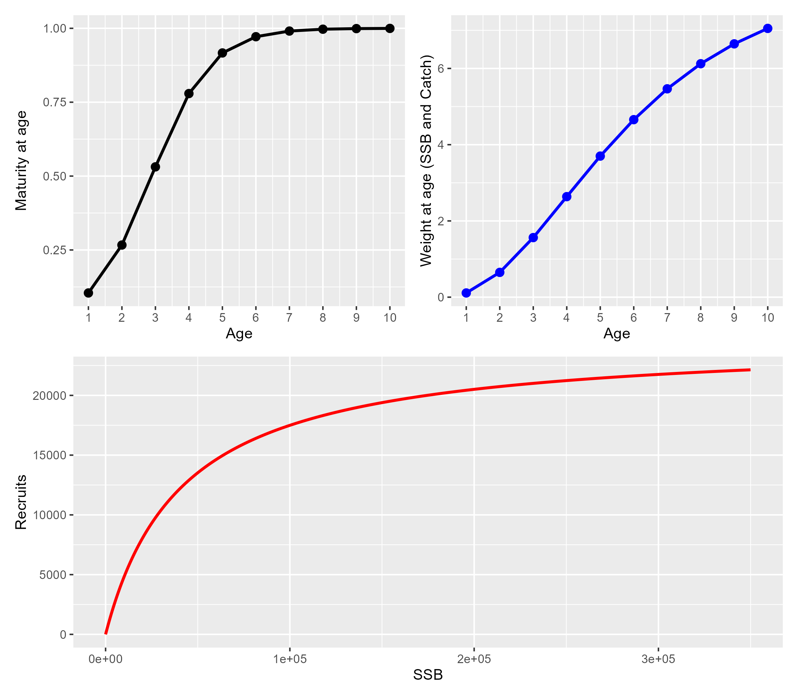

```{r setup, echo=FALSE}
knitr::opts_chunk$set(echo = FALSE)
```

# TORs


## TOR 2

- paste TOR2 

## TOR3 

- paste TOR3


## R Markdown

If you have trouble knitting this file, check out this page: https://stackoverflow.com/questions/67696286/error-generating-pdf-using-knitr-to-pdf-in-rstudio

<!-- * need to make the logo smaller on title and content slides (put it in the footer) -->

<!-- This is an R Markdown presentation. Markdown is a simple formatting syntax for authoring HTML, PDF, and MS Word documents. For more details on using R Markdown see <http://rmarkdown.rstudio.com>. -->

<!-- When you click the **Knit** button a document will be generated that includes both content as well as the output of any embedded R code chunks within the document. -->

# Background

## Outline

- 'Stock' parameters
- Fishery and index Parameters
- OM factors and simulated data examples
- EM models
- Beta standardization
- Analysis & Results
- Conclusions
- Future Work


# Inputs

## Stock parameters for generic gadid

```{r , echo=FALSE, message=FALSE, warnings=FALSE, results='hide'}
library(patchwork)
library(tidyverse)
library(wham)
naa_om_inputs <- readRDS(file.path(here::here(),"Project_0","inputs", "NAA_om_inputs.RDS"))
om.data <- naa_om_inputs[[1]]$data
mat.waa <- as_tibble(cbind(Age=seq(1, om.data$n_ages), WAA=om.data$waa[1,1,], Mat = om.data$mature[1,] ))
temp <- fit_wham(naa_om_inputs[[1]], do.fit = FALSE, MakeADFun.silent = TRUE)
SRab <- exp(c(temp$rep$log_SR_a[1], temp$rep$log_SR_b[1]))
srr <- as_tibble(cbind(SSB=seq(0,3.5e5, length=1000), Recruits= (SRab[1]*seq(0,3.5e5, length=1000)/(1+SRab[2]*seq(0,3.5e5, length=1000)) )  ))

mat.plot <- ggplot(mat.waa, aes(x=Age, y=Mat)) +
  geom_line(linewidth=1) +
  geom_point(size=2.5) +
  ylab('Maturity at age') +
  scale_x_continuous(breaks=mat.waa$Age, labels=as.character(mat.waa$Age))+
  theme(axis.text.x = element_text(size = 15))   + 
  theme(axis.text.y = element_text(size = 15)) +
  theme(axis.title.x = element_text(size = 16))   + 
  theme(axis.title.y = element_text(size = 16))  
ggsave(mat.plot, filename=file.path(here::here(), 'Ecov_study','recruitment_functions', 'presentation','plots', 
                           'mat.plot.png'), height=3, width=4)
waa.plot <- ggplot(mat.waa, aes(x=Age, y=WAA)) +
  geom_line(linewidth=1, color='blue') +
  geom_point(size=2.5, color='blue') +
  ylab('Weight at age (SSB and Catch)') +
  scale_x_continuous(breaks=mat.waa$Age, labels=as.character(mat.waa$Age))  +
  theme(axis.text.x = element_text(size = 15))   + 
  theme(axis.text.y = element_text(size = 15))  + 
  theme(axis.title.y = element_text(size = 16))  + 
  theme(axis.title.x = element_text(size = 16))  
ggsave(waa.plot, filename=file.path(here::here(), 'Ecov_study','recruitment_functions', 'presentation','plots', 
                           'waa.plot.png'), height=3, width=4)

srr.plot <- ggplot(srr, aes(x=SSB, y=Recruits)) +
  geom_line(linewidth=1, color='red')  +
  theme(axis.text.x = element_text(size = 15))   + 
  theme(axis.text.y = element_text(size = 15))  + 
  theme(axis.title.y = element_text(size = 16))  + 
  theme(axis.title.x = element_text(size = 16))  
  # geom_point(size=2.5, color='blue') +
  # ylab('Weight at age (SSB and Catch)')
ggsave(srr.plot, filename=file.path(here::here(), 'Ecov_study','recruitment_functions', 'presentation','plots', 
                           'srr.plot.png'), height=3, width=8)


bio.plot <- (mat.plot|waa.plot)/srr.plot
# ggsave(bio.plot, filename=file.path(here::here(), 'Ecov_study','recruitment_functions', 'presentation','plots', 'bio.plot.png'),  height=7, width=8)

plot(bio.plot)
```
<!--  -->
<!-- \includegraphics{file.path(here::here(), 'Ecov_study','recruitment_functions', 'presentation','plots', 'bio.plot.pdf')} -->
<!-- - make some plots of maturity at age, weight at age, true deterministic SRR -->


## Fishery and index parameters

<!-- -- example chunk to include figure from file -->
```{r,  echo=FALSE, message=FALSE, warnings=FALSE, results='hide', out.width='75%', fig.align='center'}
gf_info = make_basic_info()

#selectivity is not changing
gf_selectivity <- list(model       =c(rep("logistic", gf_info$n_fleets),rep("logistic", gf_info$n_indices)),
                       initial_pars=rep(list(c(5,1)), gf_info$n_fleets + gf_info$n_indices)) #fleet, index

a50 = gf_selectivity$initial_pars[[1]][1]
k= gf_selectivity$initial_pars[[1]][2]
sel.tmp <- 1.0/(1.0 + exp(-(seq(1, om.data$n_ages) - a50)/k))
sel <- sel.tmp/sel.tmp[om.data$n_ages]
fish.sel <- as_tibble(cbind(Age=seq(1, om.data$n_ages), Sel=sel))
ggplot(fish.sel, aes(x=Age, y=Sel)) +
  geom_line(color='green4', linewidth=1) +
  geom_point(color='green4', size=2.5) +
  ylab('Fishery Selectivity at Age') +
  theme(axis.text.x = element_text(size = 15))   +
  theme(axis.text.y = element_text(size = 15))  +
  theme(axis.title.y = element_text(size = 16))  +
  theme(axis.title.x = element_text(size = 16))


```

# OM

## OM factors and simulated data examples

<!-- -- example chunk to include figure from file -->
```{r, out.width='25%', fig.align='center'}
 knitr::include_graphics(file.path(here::here(), 'Ecov_study','recruitment_functions', 'plots_beta_fix', 'model_probability_beta_fix.png') )
```

- make some plots to illustrate OM inputs and resulting simulated data generated
- looks like i can have multiple bullets below a figure


## Couple of slides for Beta standardization

- greg's plots


# EM

## EM models

- simple bullets above table
- we only have 6 EMs that were considered

```{r,  echo=FALSE, message=FALSE, warnings=FALSE}


df.ems    <- readRDS(file.path(here::here(),"Ecov_study", "recruitment_functions", "inputs", "df.ems.RDS"))

em_tib <- as_tibble(df.ems) %>%
  mutate(SR=ifelse(r_mod==2, 'Mean', 'BH')) %>%
  mutate(EM_mod = paste0(SR, "_", ecov_how), EM=seq(1,6))

   knitr::kable(em_tib)
  # print(em_tib)


```


# Analysis & Results

## Analyses

\begin{enumerate}
  \item Convergence of the estimating models
  \item Model identifiability of an underlying stock recruitment model and/or an underlying relationship
   between environmental covariate
  \item $\Delta$AIC and model probability
  \item Assessment error (recruitment, spawning stock biomass, and Fbar)
  \item Bias of estimated parameters
  \item Mohn's $\rho$
  \item Projection performance relative to assumptions about the environmental covariate
\end{enumerate}


## Convergence

## Model Identifiability

##  $\Delta$AIC and model probability

## Assessment error (recruitment, spawning stock biomass, and Fbar)

## Bias of estimated parameters

## Mohn's $\rho$

## Projection performance relative to assumptions about the environmental covariate


# Conclusions

## Take-aways
- These are the take-aways (copy from WP)

# Future Work

## List of what's next
 
- This is what we suggest for follow-up

---

Acknowledgements

- This work could not have been completed without the use of Azure computing (NOAA) and MIT (... greg to fill in)
- We thank other members of the SSRTWG for thoughtful comments during earlier discussions and presentations of this work


<!-- ```{r cars, echo = TRUE} -->
<!-- summary(cars) -->
<!-- ``` -->

<!-- ## Slide with Plot -->

<!-- ```{r pressure} -->
<!-- plot(pressure) -->
<!-- ``` -->

