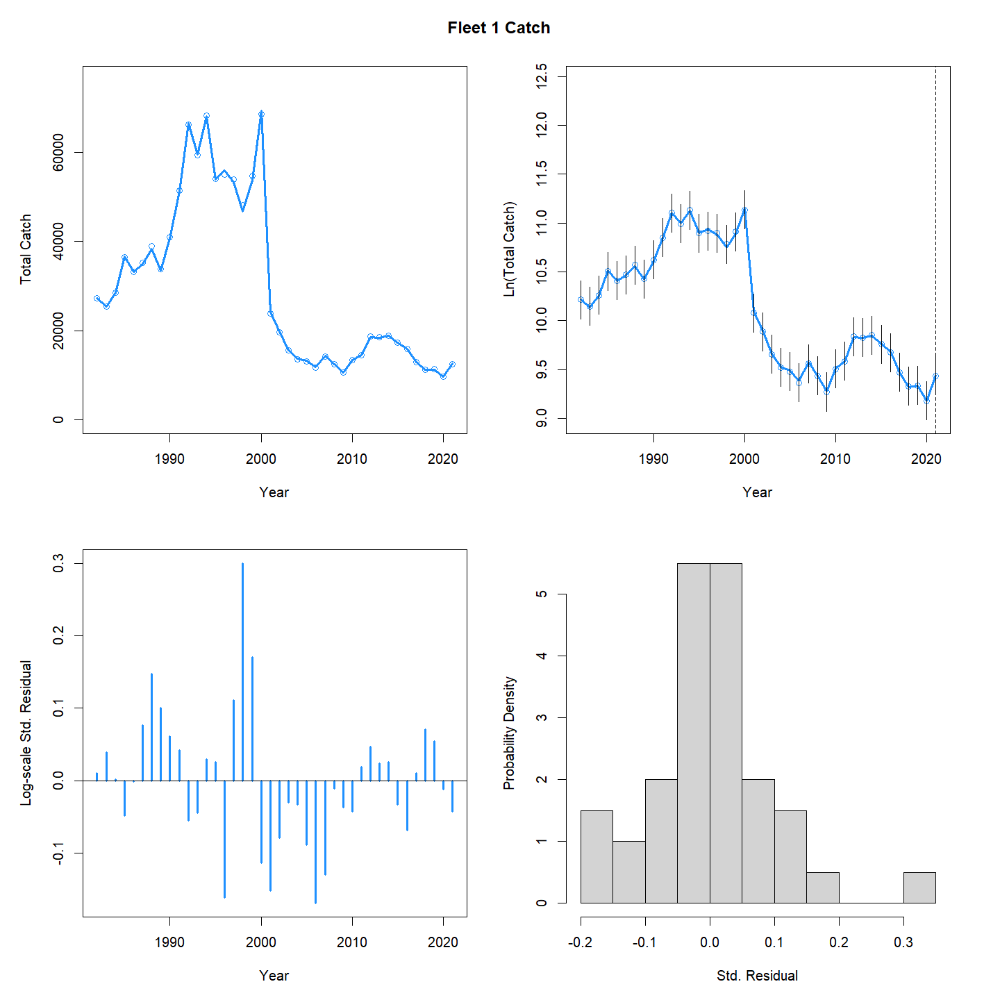
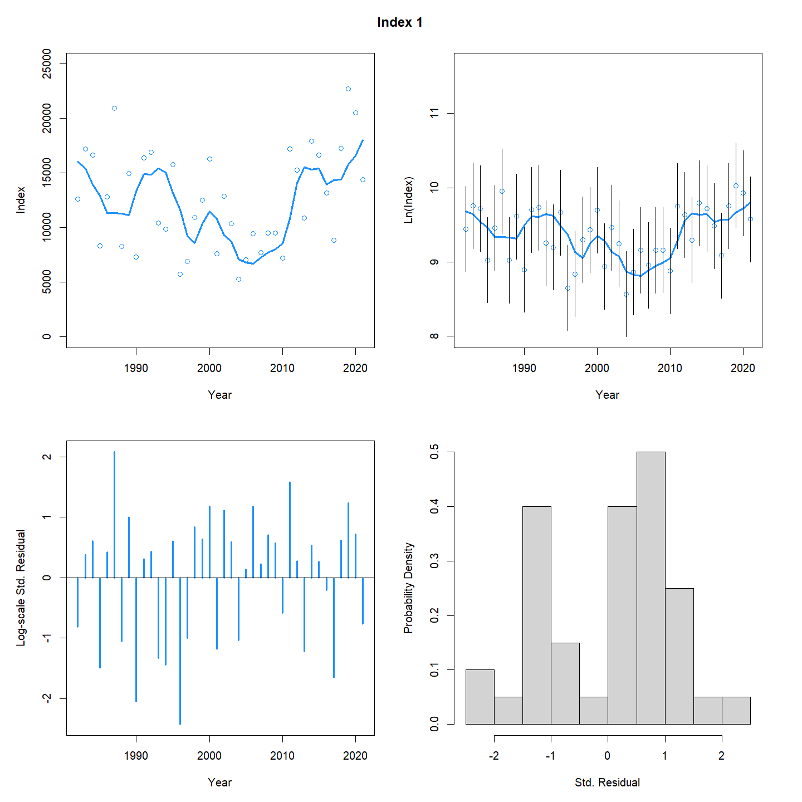
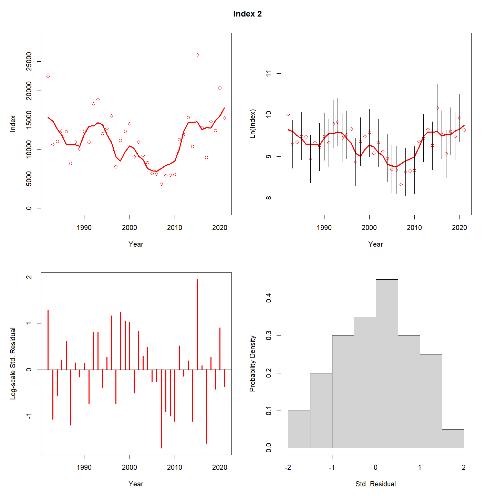
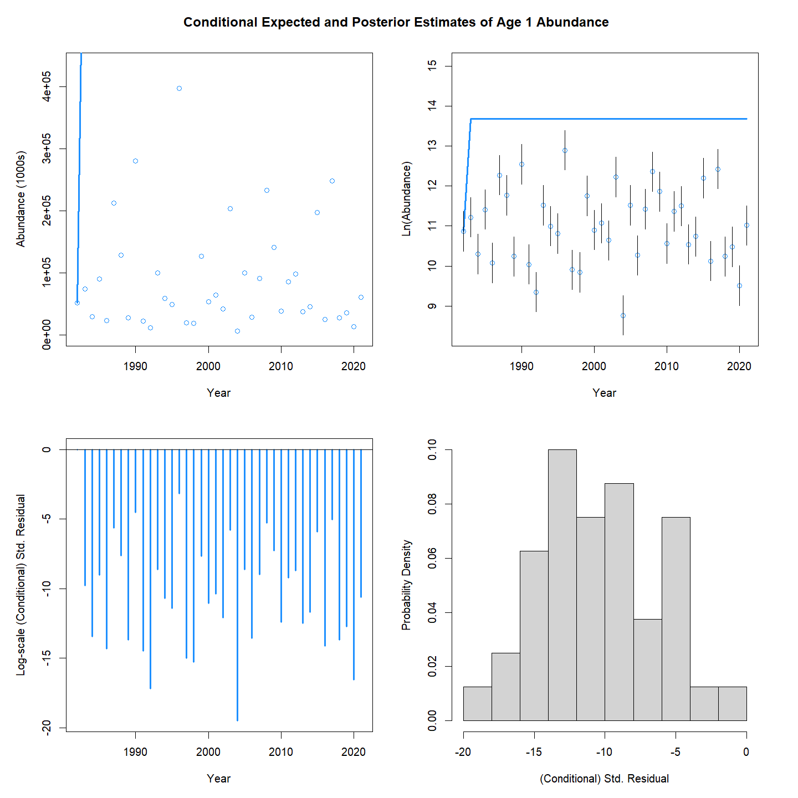
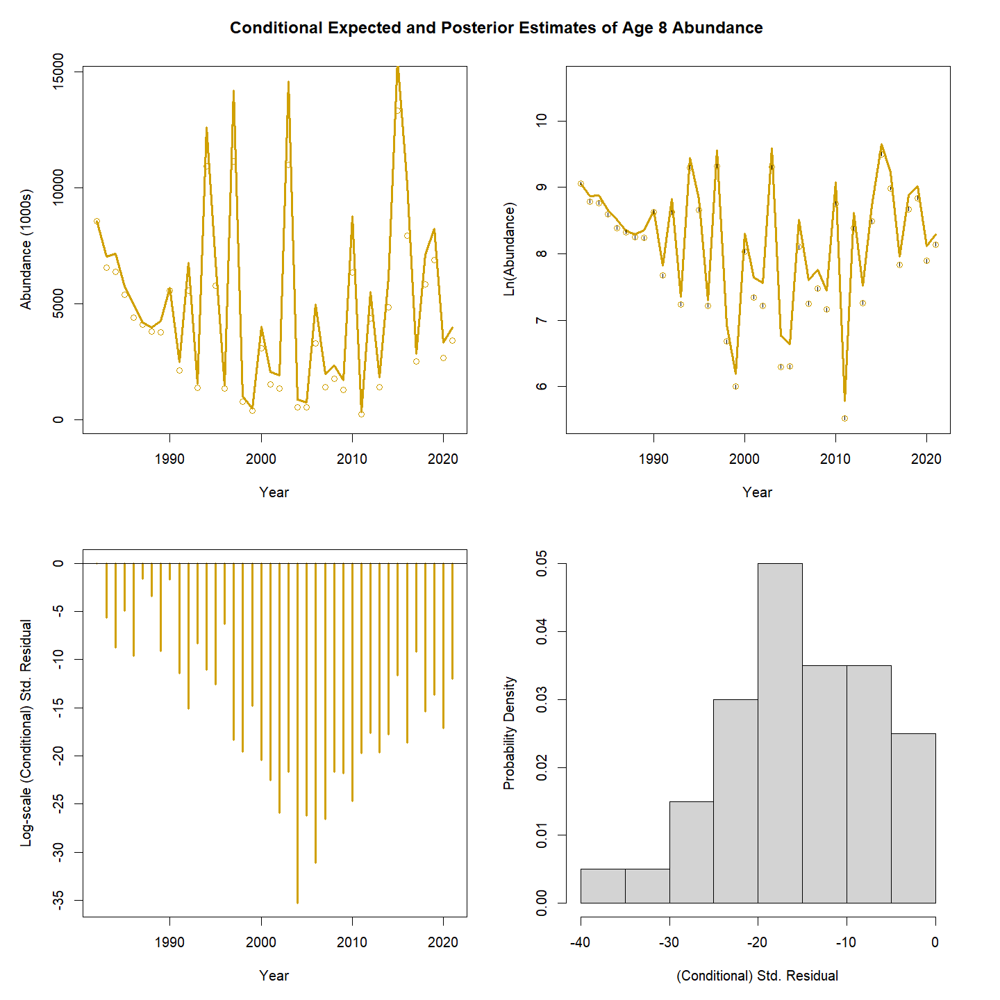
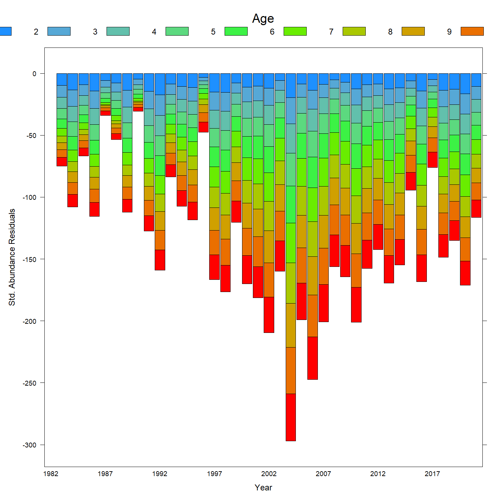

```{r setup, include=FALSE}
knitr::opts_chunk$set(echo = TRUE)
library(wham)
library(tidyr)
library(dplyr)
library(here)
library(ggplot2)

source(file.path(here(), "common_code", "make_basic_info.R"))
source(file.path(here(), "common_code", "bias_data.R"))
```

## Overview

This demonstration explores a single realization of catch misspecification with different levels of state-space models applied to the misspecified data. The goal is to demonstrate the diagnostics that can detect the misspecification and/or account for the problem. For comparison, a correctly specified model is also shown.

## Building the data sets

The process starts with creating an initial data set using the make_basic_info function and assigning values for selectivity, natural mortality, and recruitment. For this example, there is a single fleet and two indices all with logistic selectivity, natural mortality is constant at 0.2 for all years and ages, and there is no stock-recruitment relationship (recruitment varies as an identical and independent deviation about the mean). The prepare_wham_input function creates the correctly specified input formulation. 

```{r data}
# only doing one simulation here, but keep structure for multiple sims for use later
nsim <- 1

# create input
groundfish_info <- make_basic_info()

gf_selectivity = list(
  model = c(rep("logistic", groundfish_info$n_fleets),rep("logistic", groundfish_info$n_indices)),
  initial_pars = rep(list(c(5,1)), groundfish_info$n_fleets + groundfish_info$n_indices)) #fleet, index

gf_M = list(initial_means = rep(0.2, length(groundfish_info$ages)))

gf_NAA_re = list(
  N1_pars = exp(10)*exp(-(0:(length(groundfish_info$ages)-1))*gf_M$initial_means[1]),
  sigma = "rec", #random about mean
  cor="iid", #random effects are independent
  use_steepness = 0,
  recruit_model = 2, #random effects with a constant mean
  recruit_pars = exp(10)
)

input <- prepare_wham_input(basic_info = groundfish_info, 
                            selectivity = gf_selectivity, 
                            NAA_re = gf_NAA_re, 
                            M= gf_M)

```

The fit_wham function is run without fitting the model to create the operating model.

```{r runstarter}
# run starter input
om <- fit_wham(input, do.fit = FALSE, MakeADFun.silent = TRUE)
```

Four estimation models are created using different levels of "state-spaceness" for the population numbers at age and recruitment formulations. The first estimation model exactly matches the operating model, meaning recruitment is estimated as a random effect about a mean value as independent and identical deviates. Ages 2 and older follow the population equation just as a statistical catch-at-age model would. The second estimation model also only has random effects for recruitment, but in this case the deviations are estimated as an autoregressive process over time. The third estimation model allows for random effects in both recruitment and for all other ages. This is the first full state-space model in the series. The random effects are all treated as independent and identical deviates with two separate sigmas estimated, one for recruitment and the other for all other ages. The fourth estimation model is also a full state-space model but the random effects are modeled as a two dimensional autoregressive process over both ages and years, with recruitment being treated separately from all other ages.

```{r makeem}
# set up estimation models
em_input1 <- input 

gf_NAA_re2 <- gf_NAA_re
gf_NAA_re2$cor <- "ar1_y"
em_input2 <- prepare_wham_input(basic_info = groundfish_info, 
                                selectivity = gf_selectivity, 
                                NAA_re = gf_NAA_re2, 
                                M= gf_M)

gf_NAA_re3 <- gf_NAA_re
gf_NAA_re3$sigma <- "rec+1"
em_input3 <- prepare_wham_input(basic_info = groundfish_info, 
                                selectivity = gf_selectivity, 
                                NAA_re = gf_NAA_re3, 
                                M= gf_M)

gf_NAA_re4 <- gf_NAA_re
gf_NAA_re4$cor <- "2dar1"
gf_NAA_re4$sigma <- "rec+1"
em_input4 <- prepare_wham_input(basic_info = groundfish_info, 
                                selectivity = gf_selectivity, 
                                NAA_re = gf_NAA_re4, 
                                M= gf_M)
```

Simulated data are created under two conditions: correctly and incorrectly reported catch in the recent years of the assessment. The incorrectly reported catch uses the bias_data function. In this example, catch is under-reported, the catch provided to the wham model is only one third of the actual catch for the second half of the assessment time period. The four estimation models are then set up to be applied to the two sets of data, resulting in a total of 8 models. The first four sim_inputs use the correct catch data while the last four sim_inputs use the under-reported catch data.

```{r simdata}
#simulate data from operating model
#all RE and data are simulated
sim_input <- list()

# sim_input[[1]] has no data modification and em1
set.seed(14159265) #use same seed for all operating models
sim_input[[1]] = lapply(1:nsim, function(x) {
  input_i = em_input1
  sim = om$simulate(complete=TRUE)
  input_i$data = sim
  return(input_i)
})

# sim_input[[2]] uses the correct data and em2
sim_input[[2]] = lapply(1:nsim, function(x) {
  input_i = em_input2
  obs_names = c("agg_indices","agg_catch","catch_paa","index_paa", "Ecov_obs", "obsvec")
  input_i$data[obs_names] = sim_input[[1]][[x]]$data[obs_names]
  return(input_i)
})

# sim_input[[3]] uses the correct data and em3
sim_input[[3]] = lapply(1:nsim, function(x) {
  input_i = em_input3
  obs_names = c("agg_indices","agg_catch","catch_paa","index_paa", "Ecov_obs", "obsvec")
  input_i$data[obs_names] = sim_input[[1]][[x]]$data[obs_names]
  return(input_i)
})

# sim_input[[4]] uses the correct data and em4
sim_input[[4]] = lapply(1:nsim, function(x) {
  input_i = em_input4
  obs_names = c("agg_indices","agg_catch","catch_paa","index_paa", "Ecov_obs", "obsvec")
  input_i$data[obs_names] = sim_input[[1]][[x]]$data[obs_names]
  return(input_i)
})

# now create the under-reported catch data
# sim_input[[5]] has under-reported catch and em1
set.seed(14159265) #use same seed for all operating models
agg_catch_multiplier <- create_agg_catch_multiplier(input, multiplier=0.33)
sim_input[[5]] = lapply(1:nsim, function(x) {
  input_i = em_input1
  sim = om$simulate(complete=TRUE)
  sim <- bias_data(sim, multiply_agg_catch_flag=TRUE,
                   agg_catch_multiplier=agg_catch_multiplier)
  input_i$data = sim
  return(input_i)
})

# sim_input[[6]] has under-reported catch and em2
sim_input[[6]] = lapply(1:nsim, function(x) {
  input_i = em_input2
  obs_names = c("agg_indices","agg_catch","catch_paa","index_paa", "Ecov_obs", "obsvec")
  input_i$data[obs_names] = sim_input[[5]][[x]]$data[obs_names]
  return(input_i)
})

# sim_input[[7]] has under-reported catch and em3
sim_input[[7]] = lapply(1:nsim, function(x) {
  input_i = em_input3
  obs_names = c("agg_indices","agg_catch","catch_paa","index_paa", "Ecov_obs", "obsvec")
  input_i$data[obs_names] = sim_input[[5]][[x]]$data[obs_names]
  return(input_i)
})

# sim_input[[8]] has under-reported catch and em4
sim_input[[8]] = lapply(1:nsim, function(x) {
  input_i = em_input4
  obs_names = c("agg_indices","agg_catch","catch_paa","index_paa", "Ecov_obs", "obsvec")
  input_i$data[obs_names] = sim_input[[5]][[x]]$data[obs_names]
  return(input_i)
})
```

Check to see that the eight data sets have the correct aggregate catch. Models 1-4 have the true catch, while models 5-8 have the under-reported catch in recent years.

```{r aggcatchcheck}
aggc <- tibble(Model = character(), Year = integer(), AggCatch = double())
for (m in 1:8){
  aggcdat <- lapply(1:nsim, function(x){
    out <- sim_input[[m]][[x]]$data$agg_catch
  return(out)
  })
  thisaggc <- tibble(Model = m, 
                     Year = 1:sim_input[[m]][[1]]$data$n_years_model, 
                     AggCatch = unlist(aggcdat))
  aggc <- rbind(aggc, thisaggc)
}

p1 <- ggplot(aggc, aes(x=Year, y=AggCatch)) +
  geom_point() +
  geom_line() +
  facet_wrap(~Model, ncol = 4) +
  expand_limits(y = 0) +
  theme_bw()

print(p1)

```

Now run the eight models. This may take a few minutes. The Rmarkdown compilation checks to see if the file misspec_demo_fits.RDS is present in the misspecification_study directory. If it is, it simply reads that file. If it is not, then the model is run. So if you change any of the settings above, be sure to remove the RDS file before knitting the Rmarkdown script. This RDS file is relatively large (~16 MB), so is not saved on the GitHub repo.

```{r runmodels}
if(file.exists(file.path(here(), "misspecification_study", "misspec_demo_fits.RDS"))){
  em_fits <- readRDS(file.path(here(), "misspecification_study", "misspec_demo_fits.RDS"))
} else {
  # run the models
  em_fits = list()
  for(m in 1:8){
    em_fits[[m]] = lapply(1:nsim, function(x){
      out = fit_wham(sim_input[[m]][[x]], 
                     do.osa = FALSE,
                     MakeADFun.silent = TRUE, 
                     retro.silent = TRUE, 
                     save.sdrep = FALSE)
      return(out)
    })
  }
  saveRDS(em_fits, file.path(here(), "misspecification_study", "misspec_demo_fits.RDS"))
}
```

Start by making sure all the models converged. Model 4 (correct data with estimation model 4) did not converge. Kept in for now just for completeness, but this is a good reminder to make sure the model converges before digging into the results.

```{r converged}
check_convergence(em_fits[[1]][[1]])
check_convergence(em_fits[[2]][[1]])
check_convergence(em_fits[[3]][[1]])
check_convergence(em_fits[[4]][[1]])
check_convergence(em_fits[[5]][[1]])
check_convergence(em_fits[[6]][[1]])
check_convergence(em_fits[[7]][[1]])
check_convergence(em_fits[[8]][[1]])
```

We can see which model has the best fit using the compare_wham_models function for the two sets of data. Start with the correctly reported catch data (CD). We see all four estimation models (em) fit the data similarly for F, recruitment, and SSB, with similar CVs for each. Estimation model 2 (AR1 random walk in recruitment) was preferred over the other three estimation models, but the differences in AIC were not great (<5 units). Mohn's rho for SSB and F and were low for all four estimation models (absolute values < 0.6). 

```{r comparecorrect}
correct_data_compare <- compare_wham_models(list(CD_em1 = em_fits[[1]][[1]],
                                                 CD_em2 = em_fits[[2]][[1]],
                                                 CD_em3 = em_fits[[3]][[1]],
                                                 CD_em4 = em_fits[[4]][[1]]))

print(correct_data_compare$g[[1]])
print(correct_data_compare$g[[2]])
```

The under-reported catch data (UR) found greater differences among the four models. Estimation model 4 (full state-spcae with 2dar1 correlations) was the preferred model based on AIC, with the other models >50 units worse. The Mohn's rho values for SSB and F for estimation model 4 were lower than all the values from the correct data, while the other three estimation models were all worse (absolute values >0.20). So according to both AIC and the retrospective diagnostic, estimation model 4 is highly preferred to the other three estimation models for the under-reported catch data. All four estimation models show a spike in F in year 2000, just before the catch under-reporting begins. The big difference is in the scale of the F, recruitment, and SSB point estimates, with estimation model 4 showing lower F and higher recruitment and SSB than the other three estimation models. The trends in F, recruitment, and SSB are similar though. The uncertainty of estimation model 4 is much higher than the other three models. It is not clear what is driving the large uncertainty in estimation model 4 (Tim - do you have any thoughts?). 

```{r comparemisspec}
misspecified_data_compare <- compare_wham_models(list(UR_em1 = em_fits[[5]][[1]],
                                                      UR_em2 = em_fits[[6]][[1]],
                                                      UR_em3 = em_fits[[7]][[1]],
                                                      UR_em4 = em_fits[[8]][[1]]))
                                            
print(misspecified_data_compare$g[[1]])
print(misspecified_data_compare$g[[2]])
```

Looking at the fits to the under-reported data for estimation model 4 (using plot_wham_output(mod=em_fits[[8]][[1]], out.type='html')), I was surprised by how well most things fit, with no obvious patterning in residuals or obvious misfits. The one bad diagnostic I saw was the conditional expected and posterior estimates of abundance at all ages where the line was above all the points for all years and ages. So there was one diagnostic that indicated that there is a model misfit, but not anything that jumped out at me from the tabular data that could easily be grabbed when running lots of realizations. 

```{r plotemfit8}
# note could not get the following code to run within Rmarkdown (it produced the png files but not the pdf)
# can either pull this code out and run in console, or else uncomment and knit then comment and knit again
#em8.dir <- file.path(here(), "misspecification_study", "UR_em4")
#if(!dir.exists(em8.dir)){
#  dir.create(em8.dir)
#}
#plot_wham_output(mod=em_fits[[8]][[1]], dir.main=em8.dir)

```

The catch and index four panel plots all look good for UR_em4.







The problematic diagnostic is the NAA 4 panel plots, show below for ages 1 and 8 as well as the stacked barplot of residuals.




